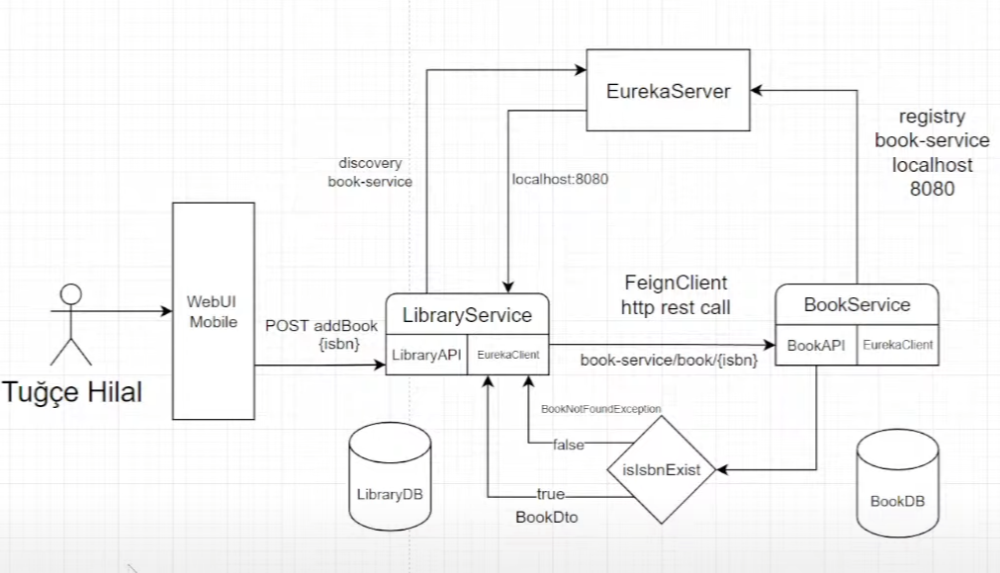

## Kitaplik-Online Microservice REST Mimari

---

 

## Microservice Terminolojisi

### Fault Tolerance
  - Olası hata durumlarından sonra farklı bir davranış yaratma işlemine verilen isimdir.
  - Spring dünyasında Hystrix kütüphanesi ile yapılabilen bir işlemdir. Ancak Spring Cloud 2021.0.4 versiyonu ile bu kütüphane deprecate edilmiştir.

_**Yukarıdaki kütüphane yerine Spring Cloud CircuitBreaker Resilience4j kullanılmalıdır.**_
 [Resilience Docs](https://resilience4j.readme.io/docs/examples)
 [Spring Cloud Circuit Breaker Docs](https://spring.io/projects/spring-cloud-circuitbreaker/)
---
### SOA (Service-Oriented Architecture)
- Uygulama componentlerinin, çeşitli protokoller ile ağ üzerinden birbirleriyle iletişime geçtiği bir mimarı yaklaşımdır.
- Örneğin bir servisin HTTP Protokolünü kullanarak başka bir servisten veri transferi yapması işlemine SOA denebilir.

### WOA (Web-Oriented Architecture)
 

---
### CAP Theorem (Consistency, Availability, Partition Tolerance)
- #### Consistency
  -  Microservice gibi dağıtık sistemlerde bir sunucuya istek gönderildiğinde her bir servisin isteğine aynı cevap dönebilmelidir.  Örneğin A ve B servisleri olsun. A servisi güncellerken B servisi de güncelledi.  Daha sonra A servisine bir istekte bulunulduğunda B servisinin de en güncel hali yanıt olarak dönmelidir.
  -  Bu olaya **Data Sync** denir. Bunu sağlamak için çeşitli toollar kullanılabilir. **Distributed Lock (Redis), Kafka, RabbitMQ, Event Sourcing vb.**
      -  **Event Sourcing** --> Sistemdeki tüm durum değişikliklerini (olayları) kaydetmeyi ve bu olaylardan sistemin mevcut durumunu oluşturmayı amaçlayan bir tasarım desenidir.  Bu sayede, sistemin geçmiş durumu tamamen yeniden oluşturulabilir ve her bir durum değişikliği geri alınabilir, sorgulanabilir veya analiz edilebilir.
      -  **Distributed Lock** --> Distributed Lock birden fazla bileşen veya uygulamanın aynı kaynağa eş zamanlı erişimini sınırlamak için kullanılan bir koordinasyon mekanizmasıdır.
- #### Availability
    - Dağıtık olan sunuculara bağlı iş akışına sorgu atıldığında bir cevap alınabilmelidir.  Örneğin 5 tane bu iş akışına bağlı sorgu varsa ve bir tanesi cevap vermiyorsa geriye kalan 4 sorgudan yine de cevap dönmelidir.
- #### Partition Tolerance
  -  Dağıtık sistemler arasında iletişim koparsa kalan sunucular çalışmaya devam etmelidir.  Örneğin A, B, C servisleri arasından A ve B arasındaki iletişim koptuysa C yine de çalışmaya devam etmelidir.
---

### ACID (Atomicity, Consistency, Isolation, Durability)
- #### Atomicity 
    -  Örneğin bir güncelleme işlemi başlatıldığında bu güncelleme işlemine ait 5 adet daha güncelleme var olsun.  2 Güncelleme işlemi ardından 3. güncelleme işleminde bir sorun çıktığında güncelleme işlemi orada kalmamalıdır.   Böyle bir durumda ya bütün işlem geriye alınmalıdır ya da bütün işlem başarılı sonuçlanmalıdır.
- #### --> Bkz. [Consistency](#consistency)
- #### Isolation
  -  Aynı veri üzerinde işlem gerçekleştiren transaction birbirini etkilememelidir. Bunun için gerekirse veri setleri kilitlenmelidir.  Bu transaction'lar senkron bir şekilde çalışmalıdır.
- #### Durability
  -  Bir hata olması durumunda sistemin önceki durumuna geri dönebilmesi demektir.
---

### BASE (Basically Avaliable, Soft-State, Eventual Consistent)

 

---

## Microservice Teknolojileri

 

- ### İletişim
  - RestAPI --> Servisler arası JSON alışverişi
  - gRPC(Http6) veya Apache Thrift --> Aynı yaklaşıma sahiptirler.
  - Async Communication (Event Driven veya Event Source) --> Servisler birbirlerini direkt çağırmazlar
  - Message Broker (RabbitMQ, Kafka, Redis Pub/Sub)
---
- ### Yük Dağıtma - Load Balancing
  1. Server Side Load Balancing
       - Kubernetes LB
       - Traefik
       - HAProxy
       - Cloud Native LB : AWS Elastic LB
       - Custom LB
  2. Client Side Load Balancing
     - Spring Cloud LB
     - gRPC Client-Side LB

#### _!! Genel olarak Client-SideLoad Balancing öğretilir. Bunu sebebi kodlamasının kolay olmasıdır._

---
- ### Loglama
  - Zipkin Client - Spring Fw
  - Jeager - K8s
  - AWS Cloudwatch
  - Logstash - ElasticSearch
---
- ### Orchestration - Auto Scaling
  - K8s --> Kubernetes
  - Azure K8s Service
  - Mesos
  - Aws Elastic Container Service
---
- ### Service Discovery
  #### A ve B servislerinin birbirini bulabilmesini sağlayan ara yönlendirici katman görevi gören yapılardır.
  - Netflix Eureka - Spring Fw
  - Consul - HashiCorp
  - K8s - Etcd Service
  - Zookeeper - Apache
---
- ### Async Communication
  - Apache Kafka
  - RabbitMQ
  - AWS Simple Queue Service (SQS)
  - Google Cloud Pub/Sub
---
- ### Hata Ayıklama
  - Hystrix
  - Polly
  - Retry and Timeout Design Pattern (custom)
---

## Mikroservisler Arası İletişim

### Rest Template 
- Rest Template bir dış API' den veri transferi yapmak için ilk kullanılan yöntemlerden biridir. 
 Örneğin A ve B mikroservisleri arasındaki bir veri transferi yapılacağı zaman Rest Template kullanılabilir. Ancak bu bazı bağımlılıklara yol açmaktadır. 
 Rest template de bir servise istek atılacağı zaman o servisin url' i tam olarak bilinmelidir. 
 Url' de bir değişiklik yapıldığında; örneğin `localhost:8080` yerine `8081` veya `localhost:8080/v1/user` yerine `/v2/user` olduğunda Rest Template için de bu değişiklikleri yapmak gerekmektedir.
 Bu durum da bir bağımlılığa yol açmaktadır. Bunu gidermek için **Eureka** adında bir teknoloji kullanılmaktadır.

### Eureka ve FeignClient 
- Eureka servislerin API'larını tanımladığı ve dolayısıyla url' lerinin tutulduğu bir teknolojidir. Rest Template' de yaşanılan bağımlılık burada giderilmeye çalışılır.
 Öncelikle hem A hem de B servisi kendisini Eureka' ya bir **Eureka Client** aracılığıyla tanıtır.
 Bu durumda A servisi için Eureka, `localhost:8080 `gibi bir base url mantığıyla bir url tutar. Bu durum portta yapılacak bir değişiklikte servislerin etkilenmemesini sağlar.
 Yani A servisinin portu `8081` olduğunda B servisinden A servisine atılacak herhangi bir istek durumunda A servisinde port değişikliği yapmaya gerek kalmaz.
 Tabii ki bu durumda da bağımlılık Eureka' ya olmaktadır. Çünkü Eureka bulutta çalışmadığında bütün iletişim kopacak ve uygulama çalışmayacaktır.
 Bu durumun önüne geçmek için sunucularda her zaman Eureka' ya yüksek öncelik verilir. Eureka' nın bulunduğu pod' a gerçek zamanlı olarak dinleme yapabilmek adına sinyaller gönderilir. 
 Olası bir sorun oluştuğunda bu sorun henüz daha uygulamanın diğer alanlarına ulaşmadan, bu pod yerine yeni bir pod ayağa kaldırılır ve bu sayede Eureka' da herhangi bir hata olması durumu minimize edilebilir.
 [Eureka UI - (locahgost:8761)](http://localhost:8761/)

#### _!! Eureka kullanırken genellikle onunla beraber kullanılan HttpClient aracı FeignClient'dır._

---

### Creating of Book and Library Microservices - Eureka Server Configuration - FeignClient Configuration
- Öncelikle **book-service** geliştirmesi yapılmalı ve daha sonra Eureka Server' a tanımlanmalıdır.
- Bunun için bir adet **Eureka-Server** microservice' i oluşturarak **application.properties** dosyasında gerekli ayarların yapılması gerekmektedir.
- Daha sonra `book-service/application.properties` dosyasında Eureka için bir url tanımlaması yapılmalıdır.
- Son olarak `book-service/BookServiceApplication` sınıfında @EnableEurekaClient anotasyonunu kullnaılmalıdır.
- Bu işlemler sonucunda artık **book-service, Eureka Server' a** kayıt olmuş olacaktır.
- Kontrol etmek için `localhost:8761 (Eureka application.properties deki port)` adresine gidilebilir.

- Daha sonra `library-service` microservice geliştirmesi yapılmalı ve Eureka Server' a tanımlanmalıdır.
- `libarary-service/application.properties` dosyasında Eureka için bir url tanımlaması yapılmalıdır.
- `library-service`' in, `book-service`' e erişebilmesi için önce Eureka Server' a gitmesi gerekir. Bir servisten başka bir servise istek atmak için FeignClient kullanılabilir

### FeignClient 404-Error Decoder and Fault Tolerance (Circuit Breaker)
- _**Feign Client**_ isteklerinde herhangi bir hata oluştuğunda 500, 400 gibi hataların dönmesini engellemek, 
 hatanın mesajını görebilmek ve bu hata mesajlarından Rest Response'  a dönüştürmek için bir **Feing Client Error Decoder** sınıfı yazılmalıdır.
- _**Fault Tolerance**_ bir serviste sorun olduğunda veya veritabanında ilgili veri olmadığında bir servisin nasıl davranması gerektiğini belirleyebilen bir yöntemdir.(Business case'dir)
  - **_Hata alındığında;_** 
    - _işlem durdurulabilir,_
    - _varsayılan bir response üretilebilir,_
    - _farklı bir servise yönlendirilebilir veya_
    - _hata fırlatılabilir._
---

### API Gateway, Spring Actuator, Distributed Log Trace-Zipkin
- **API Gateway** kullanılarak gelen tüm isteklere aşağıdaki işlemler yapılabilir;
  - _Scale Up_ --> Bkz.[Spring Cloud Gateway Documentation](https://docs.spring.io/spring-cloud-gateway/docs/current/reference/html/#gateway-starter)
  - _Security_ --> Bkz. [Spring Cloud Gateway Security With JWT](https://medium.com/@rajithgama/spring-cloud-gateway-security-with-jwt-23045ba59b8a)
  - _Circuit Breaker (Fault Tolerance)_ --> Bkz. [Spring Cloud Circuit Breaker](https://spring.io/projects/spring-cloud-circuitbreaker/)
  - _?Aspects (Interceptors)_
  - _Spring Boot Actuator_ --> Bkz. [Spring Boot Actuator Documentation](https://www.baeldung.com/spring-boot-actuators)

- _**Scale Up**_, bir sevis gelen isteklere yetişemediğinde bu servisten farklı portta bir tane daha instance ayağa kaldırmaktır.
   Örneğin, kullanıcı hesaplarını yöneten bir microservice, kullanıcı sayısı arttıkça ölçeklendirilmelidir(scale up).
  - _**Ölçeklendirme için**_;
    - Öncelikle bir **API Gateway** olmalıdır. Atılan istek (web, mobile tarafından) **Gateway' de** bulunan **LoadBalancing** özelliği ile ilgili servise yönlendirilir. 
     Bu işlem yapılırken **Spring Cloud Gateway**, **LoadBalancing** için arka tarafta `Round Robin` algoritmasını kullanılır.
     **Round Robin Algoritması,** gelen istekleri sırayla birden çok hedef servis arasında dolaştırır. Her bir istek, hedef servisler arasında dengeli bir şekilde dağıtılır. 
     Bu, her bir servisin eşit bir şekilde yüklenmesini sağlar.
  - APı Gateway kurulduktan sonra microservice'ler dışarıya kapatılmalıdır. Bunun için ayağa kalktıkları port '0' olarak değiştirilebilir. Bu yöntemlerden bir tanesidir.

- **Spring Boot Actuator** 
  - Uygulamadaki çeşitli adımları izleyebilmeye yarayan bir **monitoring** yöntemidir.
  - API Gateway ile birlikte kullanılabilir.
  - Actuator ayarları için gateway/application.yml dosyasına bakılabilir. Buradaki yapılandırma ile üretilen bir link üzerinden actutor yapılabilir.
 [Actuator Monitoring All Endpoints - (localhost:8888/actuator)](http://localhost:8888/actuator)

#### _ !! Bu Uygulamada API Gateway, Eureka üzerinden çalışmaktadır. _

---

### Spring Cloud Config with HashiCorp Vault
- **Cloud Config,** uygulama yapılandırmalarını merkezi bir konumda depolamak ve yönetmek için kullanılır.
 **HashiCorp Vault,** hassas verilerin güvenli bir şekilde depolanması ve erişim kontrolünün sağlanması için kullanılır.
 Bir microservice projesinde Config Server kurulduğunda servisler bu katman üzerinden yapılandırma dosyalarını çalıştırırlar.
 Bu durumda yapılandırma dosyalarının içinde bulunan önemli bilgiler(username, pass, email vb.) genellikle 'environment' denilen bir değişken ile tutulabilir.
 Windows için _**'Environment Variable'**_ altında tutulurken, Linux için bir **_'bash profile'_** dosyasına yazılır. MacOS' de ise başka bir yöntem geçerlidir.
 İşte bu değişkeni işletim sistemi üzerinde tutmak yerine _**Vault**_ gibi (Google Cloud Secret Manager, Docker Secrets vb.)hassas verileri güvenli bir şekilde depolayan teknolojiler kullanılabilir.
 HashiCorp Vault, **_AWS veya Google Cloud_** gibi ortamlarda çalıştırılarak kullanılabilirken **_localde_** de bir uygulama olarak çalıştırılabilir.
 Bu yöntem **_güvenli yapılandırma, hassas verilerin güvenli depolanması, dinamik yapılandırma, değişken erişim kontrolü, güncelleme ve rotasyon, audit_** gibi birçok avantaj sağlamaktadır.

- **_Bu avantajların sağladığı kolaylıklar aşağıdaki gibidir._**
  - **_Güvenli Yapılandırma:_** Spring Cloud Config, uygulama yapılandırmalarını merkezi bir depoda saklar. Vault, bu yapılandırmalara erişimi güvenli bir şekilde kontrol eder ve şifreleme/erişim politikalarını uygular. 
  - **_Hassas Verilerin Güvenli Depolanması:_** Vault, API anahtarları, şifreler, sertifikalar gibi hassas verilerin güvenli bir şekilde depolanmasını sağlar. Bu verilere sadece yetkili kullanıcılar veya uygulamalar erişebilir. 
  - **_Dinamik Yapılandırma Yönetimi:_** Vault, uygulama çalışma zamanında ihtiyaç duyulan yapılandırmaları sağlayabilir. Bu, uygulamanın dinamik olarak yapılandırılmasını ve değiştirilmesini mümkün kılar. 
  - **_Değişken Erişim Kontrolü:_** Vault ile entegre edildiğinde, Spring Cloud Config, Vault'un erişim kontrolü özelliklerini kullanabilir. Bu sayede belirli kullanıcıların veya uygulamaların belirli yapılandırmalara erişimini sıkı bir şekilde kontrol edebilirsiniz. 
  - **_Güncelleme ve Rotasyon:_** Vault, şifrelerin periyodik olarak güncellenmesini ve değiştirilmesini sağlar. Bu da güvenlik açısından önemli bir özelliktir. 
  - **_Audit ve İzleme:_** Vault, yapılandırmaların ve hassas verilerin kullanımını izleyerek, olası güvenlik ihlallerini tespit etme konusunda yardımcı olabilir.

---

### gRPC - g Remote Produce Call

- gRPC, yüksek performanslı ve çoklu platform destekli bir RPC sistemi sağlar. 
- RPC, uzak sunucu çağrıları yapmak için kullanılan bir protokol türüdür. 
- gRPC, **_protobuff (Protocol Buffers)_** adı verilen bir veri serileştirme formatını kullanır ve **_HTTP/2 tabanlı_** bir iletişim protokolü üzerine inşa edilmiştir.
 Bu, tek bir bağlantı üzerinden birden fazla çağrının _**eş zamanlı**_ olarak gerçekleştirilebileceği anlamına gelir. 
 HTTP/2'nin sunduğu diğer avantajlar arasında düşük bellek kullanımı, başlık sıkıştırma ve çoklu kanal desteği bulunmaktadır.
  - **Protobuff (Protocol Buffers)**
    - Protobuff, **_JSON ve XML'e_** kıyasla daha küçük ve daha hızlı veri yapıları üretebilen bir formattır. 
     Bu, daha **_düşük bant genişliği_** kullanımı ve **_daha hızlı veri iletimi_** anlamına gelir.
    - Protobuff _**dil bağımsız**_ çalışmaktadır. Protobuff tarafından tanımlanan veri yapıları farklı programlama dilleri arasında paylaşılabilir.
    - Protobuf, şemaları tanımlamak için kullanılır. Bu şemalar, veri yapılarının nasıl görüneceğini, hangi türdeki verileri içereceğini ve veri iletimi sırasında nasıl kullanılacağını belirtir. 
     **_Şemalar, .proto uzantılı dosyalarda_** tanımlanır.
    - Protobuf, temel veri türlerinin yanı sıra kullanıcının tanımladığı **_karmaşık veri türlerini_** destekler. 
     Örneğin, sayılar, string'ler, boolean'lar, enum'lar, listeler ve gömülü (embedded) mesajlar gibi çeşitli veri türleri bulunur.
    - Protobuf, veri iletimi sırasında taşınan temel birimlere **_"mesajlar"_** denir. Bir Protobuf mesajı, bir **_.proto dosyasında_** tanımlanan veri yapısını temsil eder. 

**Bu projede bir gRPC yapısı kullanılmıştır. Yapının kuruluş sıralaması aşağıdaki gibidir.**
  - Öncelikle **_common-service_** adında bir microservice oluşturulmalıdır. Bu servise gRPC call için gerekli bağımlılıklar eklenmelidir. 
   Bu modül, içerisinde bir **proto** dosyasını barındıracak ve bir **şablon görevi** görecektir. .proto dosyasında yapılan tanımlamalar sonucunda gRPC interfaceler ve modeller oluşturacaktır. 
   Bu interface ve modeller aracılığıyla **_gRPC Server_** tarafında bazı tanımlamalar yapılacak ve **_gRPC Client_** bu serverdaki tanımlamaları talep edebilecektir.
   Interface ve modellerin oluşturulması için **_mvn clear install_** komutunu çalıştırarak, target dosyasının oluşturulması gerekmektedir.
    **_--> Bkz. [common-service-target](common-service/target/classes/com/kitaplik/bookservice)_**
 

  - Bu uygulamada library-service --> gRPC **_client_**, book-service --> gRPC **_server_** görevi görecektir.
  - Modüllerin **_application.properties_** dosyalarına gRPC için **_yapılandırma ayaları (port vb.)_** eklenmelidir. 
   Yapılandırma ayarları eklendiğinde iki servis birbirine buradaki portlar üzerinden ulaşacaktır. Buradaki call yöntemi bilindiği gibi tipik bir REST Call değildir. 
   gRPC'de bir `client stub` veya sadece `client` olarak adlandırılan bileşen, **istemcinin gRPC sunucuyla iletişim kurmasını sağlayan** bir araçtır. 
   **Client stub(libarary-service)**, **gRPC servisi(book-service)** tarafından sunulan **metodlara** istemci tarafından erişim sağlar. 
   İki servis arasında yapılan bir gRPC Call işleminde veri, geliştiricinin **_tercih ettiği veri tipine çevrilerek_** dönecektir.

- **_Client stub'ın temel görevleri şunlardır:_**
  - **İstek ve Yanıt İletimi:** Client stub, gRPC sunucusuna istek gönderir ve sunucudan gelen yanıtları alır. Bu, RPC metodlarını çağırarak gerçekleştirilir. 
  - **Protobuff Mesajları İletilmesi:** İstekler ve yanıtlar, gRPC tarafından kullanılan Protobuf (Protocol Buffers) mesajları formatında iletilir. Client stub, bu mesajları oluşturur ve çözümler. 
  - **Uzak Sunucu Bağlantısı Yönetimi:** Client stub, gRPC sunucusu ile olan bağlantıyı yönetir. Bağlantı kurma, sürdürme ve sonlandırma gibi işlemler client stub tarafından otomatik olarak gerçekleştirilir. 
  - **Hata Yönetimi:** Client stub, gRPC sunucusu ile iletişim sırasında oluşabilecek hataları ele alır. Bu, iletişim hatası, zaman aşımı veya diğer hata durumlarını içerir.

####  !! gRPC henüz Spring-Boot-Starter entagrasyonu yapılmış bir teknoloji değildir. Ancak bu teknolojinin Spring-Boot' a entegrasyonu konusunda bir geliştirme örneği yapılmıştır. Uygulamada bu bağımlılık kullanılmıştır.   _**--> Bkz. [gRPC-Spring-Boot-Starter Documentation](https://yidongnan.github.io/grpc-spring-boot-starter/en/)**_

- Bu işlemlerden sonra `book-service' in` bir gRPC Service olabilmesi için bir **bean** oluşturulması gerekmektedir. `BookServiceApplication` sınıfı altında oluşturulmuştur.
- Daha sonra `BookGrpcServiceImpl` sınıfı oluşturulmuştur. Bu sınıf aracılığıyla `getBookIdByIsbn()` metodu oluşturulur ve **client(library-service)** tarafından çağırılmaya hazır hale getirilmiştir.
- LibraryService içerisinde `addBookToLibrary()` metodu artık gRPC üzerinden call atıp isbn numarasına göre kitabı dönecektir.
- Dönüş tipi **.proto' da** belitilen **_BookId(String)_** tipidir.

